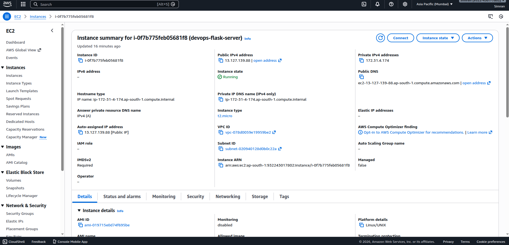

# DevOps Flask Project 🚀

## Overview
This project demonstrates an end-to-end DevOps workflow including application development, containerization, CI/CD, and cloud deployment.

## Tech Stack
- Python (Flask)
- Docker
- GitHub Actions (CI/CD)
- AWS EC2

## Features
- Containerized Flask application using Docker
- Automated CI pipeline using GitHub Actions
- Deployed on AWS EC2 instance
- Accessible via public IP

## How to Run Locally

1. Clone the repository:
   git clone https://github.com/simranGagrawal/devops-flask-project.git

2. Build Docker image:
   docker build -t flask-devops-app .

3. Run container:
   docker run -p 5000:5000 flask-devops-app

4. Open in browser:
   http://localhost:5000

## Deployment

The application was deployed on AWS EC2 using Docker and successfully tested.

(Note: Instance was terminated to avoid unnecessary costs.)
http://YOUR_PUBLIC_IP:5000

## Application Preview

## CI/CD
On every push to main branch:
- GitHub Actions builds Docker image automatically

## Author
Simran Agrawal
